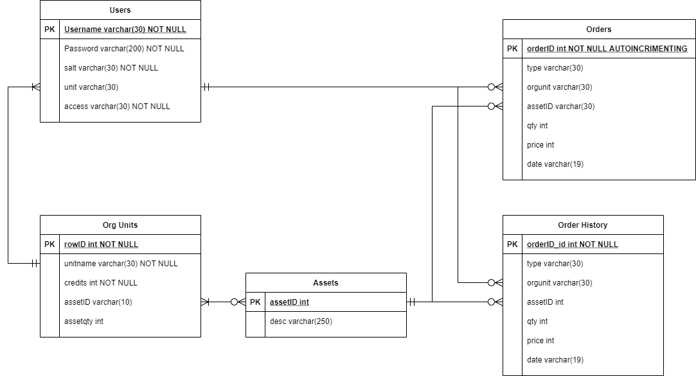
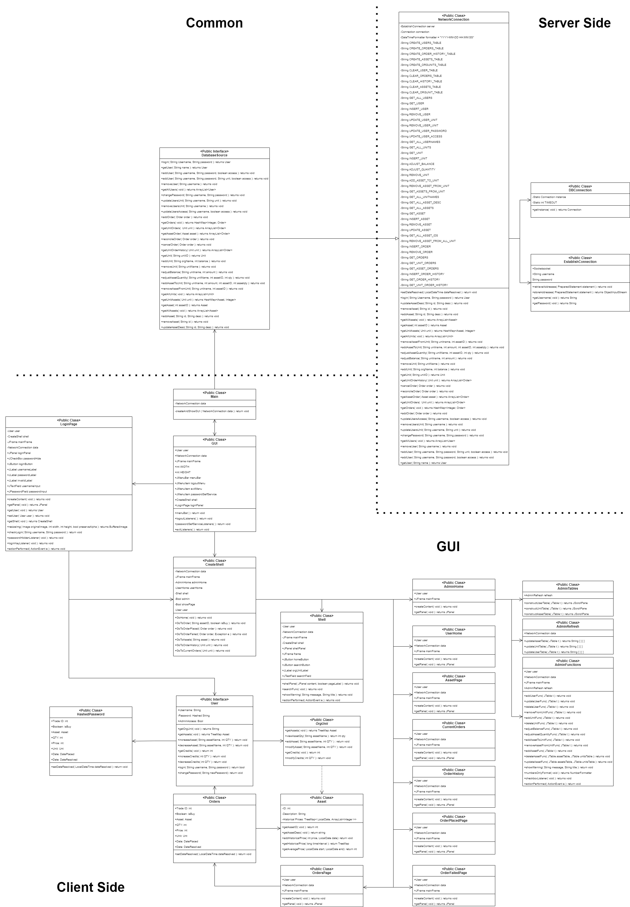
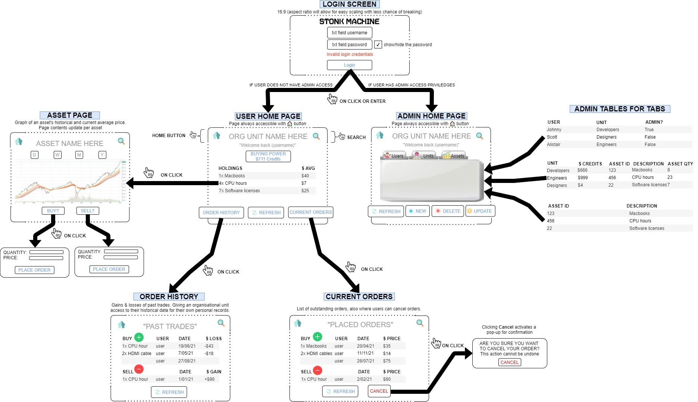

# Detailed Design Document
____
# SERVER SIDE

## Database
For this assignment a SQLite3 database will be used to store five tables of data:
- [Users](#users-table)
- [OrgUnit](#orgunit-table)
- [Assets](#assets-table)
- [Order](#order-table)
- [History](#history-table)

The relationships between these tables can be seen in the below ERD diagram.

The database settings such as:
- Protocol
- Host address
- Port
- Schema name
- Username 
- Password

Have been stored in the *"ServerSettings.props"* file to 
allow the administrators adjust the connection details, and database details before 
installation and deployment.

### Users Table
This table stores user data. It has five columns:
- Username (varchar(30), Primary Key)
- Password (varchar(200))
- Salt (varchar(30))
- Unit (varchar(30))
- Access (varchar(30))

The usernames of the users have been selected as the primary key for this database
as each individual user will require a unique login for the application. Thus, 
using the username as the primary key helps to minimise the size of the database 
upon installation and deployment.

The password is stored as a hash, made using the salt string, so that plaintext
passwords are never sent between the client and server programs. Furthermore, 
once encrypted the user's password is 250 characters long a greater amount of 
memory has been allocated for it.

The SALT string that was used to encrypt the users' password has been stored in this 
so that when a user attempts to log in, the attempted password can be encrypted using 
the same SALT string that was initially used. This allows for the stored encrypted 
password to be used to compare login details. This in turn ensures that no plain text 
passwords are ever passed over the network.

The OrgUnit ID is stored and is used as a reference to the OrgUnit table. This allows 
for users to inherit the attribute of their OrgUnit.

The access level of the users has also been stored in this table. Although in the client 
side application the access level is a boolean it has been stored as a varchar due to SQL
syntax.

### OrgUnit Table
This table is used to store a list of all the organisational units that use the app, 
their credit balance, and their associated assets. It has five columns:
- rowID (int, Primary Key)
- UnitName (string)
- Credits (int)
- AssetID (varchar(30))
- Assetqty (int)

The rowID is purely used as the Primary Key of the table. This has been done so that 
each Organisations Assets can be stored in the table without causing any uniqueness errors.

The UnitName is the list of all organisations that use the application. It is also 
the reference value used to access the table's data.

The organisations credits have also been stored in this table as a integer with no 
decimal values.

Each row that has an assetID, and the same UnitName represents a part of the inventory 
for the specified Unit. Furthermore, the assetqty in the given row represents the 
quantity of the asset held by the unit.

### Assets Table
This table is used to store the assets that can be traded in the application.
It has two columns:
- AssetID (int, Primary Key)
- Desc (String)

The assetID is the primary key for the table. It provides a simple reference ID that 
the user and application can use to find a specific asset. 

The desc value stored in this table is a more user-friendly readable description of 
the asset. This has been added to the application to provide the users with more 
understanding of what items they are trading within the application.

### Order Table
This table is used to track the unreconciled orders. This table is made up of 
several columns:
- OrderID (int, Primary Key)
- Type (varchar(30))
- Unit (string)
- Asset (int)
- Price (int)
- Qty (int)
- Date (varchar(30))

The OrderID is the ID number of a trade. This value auto increments every time an 
order is placed in the system. Due to that fact that the ID value increments every
time an order is placed, thus being unique, this value has been used as the primary 
key for the table.

The order type, a boolean in the application, has been stored as a varchar in the 
table due to SQL's syntax. This value is true for a buy order and false for a sell 
order.

The unit is the unit of the user that placed the order. The individual user was not 
stored here to help to simplify the application and its interactions with the 
database. Each order can have only one unit associated to it.

The asset is the ID of the asset that is being traded. Each order can have only one 
asset associated to it.

The price that is stored in the table is the price per asset being traded. Note, 
this is **NOT** the total price of the order. The total price of the order mus be 
calculated from the QTY and the Price. The price has been stored as an integer with 
no decimal placed.

The Qty is the quantity of the specified asset that is being trades. The quantity 
has been stored as an integer with no decimal places.

The date is the date that the order was placed on. This value is used when viewing 
when trades were placed, and to view historical prices. Due to SQLite 3's syntax 
the date has been stored as a varchar in to format "YY-MM-DD-HH-MM-SS".

### History Table
This table is used to track the reconciled orders. This table follows the 
same format as the Orders table. As such it has several columns:
- OrderID (int, Primary Key)
- Type (varchar(30))
- Unit (varchar(30))
- Asset (int)
- Price (int)
- Qty (int)
- Date (Varchar(30))

The only notable difference to the orders table is that the date that is store in 
this table is the date that the order was reconciled on. The stored date follows 
the same format as the date stored in the orders table.

---
# Server Side 
## Overall Functionality 
The server ide of the application will be composed of three main classes:
- [DBConnection](#public-class-dbconnection)
- [NetworkConnection](#public-class-networkconnection)
- [ReconcileTrades](#public-class-reconciletrades)

The DBConnection class initialises and creates a static instance of a 
connection to the database specified during setup.

The NetworkConnection class is the main point of connection to the database. 
This class implements the methods outlined in the DatabaseSource interface. The SQL
commands used to add, remove and update database entries are all stored and created 
in this class.

The ReconcileTrade class is used to reconcile all the outstanding trades in the 
database's order table. This class has been stored on the server side of the 
application because at no point does the user ever need to interact with this class.
Storing this class on the server side of the application also ensures that fewer 
TCP messages are sent over the network connection since this class will be running 
six seconds.

Furthermore, a fourth class, [EstablishConnection](#public-class-establishconnection) 
has also been created to initialise a serialised connection between the server and the 
client. Due to the time constraints of the project the serialised connection to the 
server has not yet been finalised. The completed code has been included to provide 
a solid foundation to use in the creation of a serialised connection with the server.

##Public class DBConnection
This class is used to create and hold a static connection of the database specified 
in the ServerSettings.props file. For full class details please refer to the javadoc.

## Public Class NetworkConnection
This class is used to interact with the SQLite3 database. This class implements the 
DatabaseSource interface. for full class details please refer to the javadoc. 

If a different database setup is used an alternate version of this class must be 
created to interact with the new database.

## Public Class ReconcileTrades
This class is used to reconcile all outstanding orders in the database. For full
class details please refer to the javadoc.

## Public Class EstablishConnection
This class is used to establish a serialised connection via a socket to the server
(Host) specified in the ServerSettings.props file. for full class details please 
refer to the javadoc. This class is currently unused.

---
# Public Interface DatabaseSource
This is the interface that contains all the methods used to interact with the database 
used in the application. This interface is stored in the common folder of the application
because it ise used by both the server and client side applications.

For a full list of the methods and their parameters, please refer to the javadoc.

---
# CLASS DIAGRAM 
## CLIENT-SIDE + SERVER-SIDE + GUI

The structure of the application is such that the Main class, which is used
to run the application, is dependent upon the Orders, Asset and GUI classes.
This implementation of the other classes has been deigned so that as much of
the applications' functionality can be abstracted from the top level of the
code as possible to keep in line with the principles of object orientated
programming. As such the key functionality of this application, buy/sell orders,
have been abstracted to the orders class which the main class is associated with.

The Orders class has been implemented to meet the requirements for placing trades.
This is a relatively simple class with the sole purpose of processing the trades
placed by the user and adding them to the database. In order to do this, this class
is dependant upon both the Asset class, and the User class.

The user class has been used to implement the requirements for individual users as stated
in the requirements document. Furthermore, this class also has two subclasses used to
differentiate between common users and administrators. Due to the fact that users are required
to be a part of an organisational unit this class is dependant upon the OrgUnit class being implemented.

The OrgUnit class is used to interact between the main application, and the database
for organisation specific information such as the organisations number of credits,
asset types and quantity. The UML diagram below shows that this class is only dependant
upon the Asset class due to various function in the class using the Asset class as a variable type.

The asset class is used as a means to interact with the database for asset specific information
such as historical trade data and current average price. This class is also used as a means for
interacting with the database for all assets.

The figure below shows the UML diagram for the application.

Further details for all the classes in the application can be found in the javadoc for 
the application.

## Package GUI

The GUI diagram below shows how each page connects & the design aesthetic. The GUI will always 
show the login screen as the entry point when launching the program. The purpose of this
page is to prompt users to login with their credentials to access their account and use
the functions depending on their privileges. Upon successful login, the app will branch
off to a shell page with a home and search button. Where the inner content will 
either be the user home or admin home. These paths depend on the logged-in user's admin
privileges.

- For the user home, users are greeted with their unit's holdings & credit balance. From here, users can view their order history and current orders placed by any member of
  their unit. Since all members of a unit can view all orders of that unit, they will also
  have the ability to cancel orders, allowing for a more connected experience
  between all members of a particular unit.
  
- For the admin home, users will be able to view tables for all users, units, and assets.
  This is a single page but with 3 tabs for each set of data. In each tab below each table is a control 
  panel. This is how admins are able to create and manipulate user accounts, the credit system (via units),
  and assign objects to each other.
  
- For the asset page, this is accessible through the search button where users can view a graph of the asset and place BUY and SELL orders.

